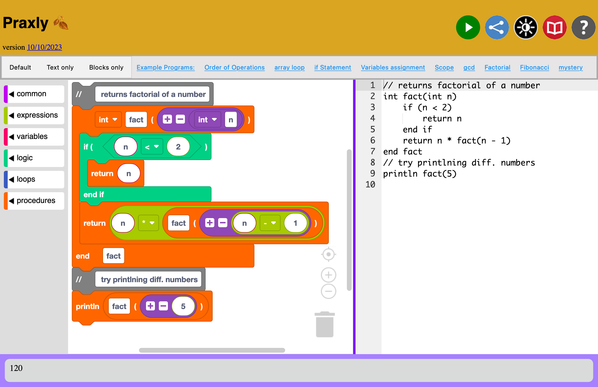

# Praxly

Praxly is an web-based IDE that empowers users to read, write, and run the pseudocode used in the [CS Praxis Test][1].
Praxly supports bidirectional synchronization between both block-based and text-based editors, allowing users to learn and visualize the code while also offering the efficiency of editing text.
The blocks are built using Google's [Blockly][2] library.

[1]: https://www.ets.org/pdfs/praxis/5652.pdf#page=21
[2]: https://developers.google.com/blockly

<figure>
    
    <figcaption>Screenshot of Praxly running a recursive factorial function</figcaption>
</figure>


## Development

Install dependencies:
```
$ npm install
```

To run locally:
```
$ npm run dev
```
